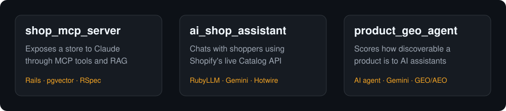

<h1 align="center">
  
</h1>

  <b>Ruby on Rails Engineer · AI Agents, RAG & MCP · Shopify & E-commerce</b> 
  Lahore, Pakistan · Open to remote roles and freelance projects

  
  
  

AI assistants can only recommend what they can read. Most online stores were built for human visitors, so their data is hard for ChatGPT, Gemini, or Perplexity to find and trust, and most Rails apps have no safe way to let an LLM work with their real data.

I'm Mohammad Ali Jesar (Ali), a Ruby on Rails engineer with 7+ years of experience building production software for international clients. I build AI into Rails applications through MCP servers, RAG, and AI agents that work with real application data, and I contributed to five production apps published on the Shopify App Store. My background is Rails performance work (Redis caching, query optimization, Sidekiq), which I now combine with LLM integrations and agentic commerce.

## What I work on

- **AI in Rails apps:** MCP (Model Context Protocol) servers, RAG (Retrieval-Augmented Generation) with PostgreSQL + pgvector, AI agents with tool calling and evals, LLM integrations with Claude, OpenAI, Gemini, and RubyLLM
- **Shopify and e-commerce:** custom Shopify apps, Shopify Functions, Checkout UI Extensions, Theme App Extensions, Admin and Storefront GraphQL APIs, BigCommerce, Amazon SP-API
- **Agentic commerce and GEO/AEO:** making online stores discoverable and shoppable by AI shopping assistants such as ChatGPT, Gemini, and Perplexity
- **Rails backends and frontends:** Hotwire (Turbo, Stimulus), React, PostgreSQL, MongoDB, Redis, Sidekiq, REST and GraphQL APIs, RSpec

## Featured projects

These three projects cover the same problem from different sides: giving an LLM safe access to store data, letting a shopper talk to a real catalog, and measuring how visible a product is to AI assistants.

  

Text version of the diagram

- shop_mcp_server: exposes a store's products, orders, and inventory to Claude through MCP tools and RAG search.
- ai_shop_assistant: chats with shoppers and searches Shopify's live Catalog API through MCP.
- product_geo_agent: scores how discoverable a Shopify product is to AI shopping assistants (GEO/AEO).

### [shop_mcp_server](https://github.com/mjesar/shop_mcp_server)
An MCP server in Ruby on Rails that connects Claude to a store's products, orders, and inventory. Schema-validated tools, approval-gated write actions (read-only and destructive annotations), transactional order creation with rollback, RAG semantic product search with Voyage AI embeddings and pgvector, and an RSpec test suite. Verified at three layers: Rails console, MCP Inspector, and a live Claude custom connector. Along the way I diagnosed a legacy SSE vs. Streamable HTTP transport mismatch and moved to the official MCP Ruby SDK.
`Rails 8.1` `MCP Ruby SDK` `PostgreSQL` `pgvector` `Voyage AI` `RSpec`

### [ai_shop_assistant](https://github.com/mjesar/ai_shop_assistant)
An AI shopping assistant that searches Shopify's live Catalog API through MCP and answers product questions conversationally, with realtime replies over Turbo Streams and background jobs on Solid Queue. It uses a hand-written HTTP/JSON-RPC MCP client, because the existing gem failed on the protocol handshake.
`Rails 8` `RubyLLM` `Google Gemini` `Hotwire` `MongoDB`

### [product_geo_agent](https://github.com/mjesar/product_geo_agent)
An AI agent that rates how discoverable a Shopify product is to AI shopping assistants (GEO/AEO). It checks product data, FAQ content, and schema.org structured data, asks an LLM whether it would recommend the product, and produces a deterministic score backed by an eval harness.
`Rails` `AI agents` `Google Gemini` `Shopify Storefront API` `GEO/AEO`

## Experience

- **MGLogics** (Dec 2021 to Jun 2026, remote): Full-stack Ruby on Rails and React engineer for Shopify and BigCommerce apps. Contributed to five apps published on the Shopify App Store, plus catalog and order sync platforms and Amazon SP-API integrations. Improved performance with Redis caching, query optimization, and Sidekiq background jobs, and owned deployment, releases, and platform compliance across Heroku, AWS, and Google Cloud.
- **SimpleDeploy** (Apr 2019 to Dec 2021): Backend software engineer building Ruby on Rails REST APIs on SQL and NoSQL databases and management MVP tools for clients in Germany.

## Shopify and BigCommerce apps I contributed to

Production apps on a Ruby on Rails and React stack, built as part of the MGLogics development team. Five are published on the Shopify App Store, and three of them are also available on BigCommerce:

- [MGLogics JSON-LD SEO Schema](https://apps.shopify.com/json-express-for-seo) (Shopify and BigCommerce): automated JSON-LD structured data for rich results and AI search. Rated 4.3/5 across 17 reviews.
- **Express Sync: Order & Inventory** (Shopify and BigCommerce): real-time sync of products, inventory, and orders between supplier and retailer stores, with price markup and currency conversion.
- [MGLogics Express SEO & Schema](https://apps.shopify.com/express-seo): image optimization, JSON-LD, alt tags, redirects, and schema management.
- [GeoLocation Traffic Redirect](https://apps.shopify.com/express-geo-redirect) (Shopify and BigCommerce): country-based redirects with pop-up and automatic options.
- [Email Validator by MGLogics](https://apps.shopify.com/express-email-validator): detects fake or invalid emails on orders to prevent order scams.

## Education

- B.S. in Information Technology (Software), Sindh Agricultural University, 2012 to 2017
- Python AI Bootcamp, Axiom Enterprises, 2018 (Flask and TensorFlow/Keras web apps with machine learning models)

## Contact

- LinkedIn: [linkedin.com/in/mjesar](https://www.linkedin.com/in/mjesar/)
- Fiverr: [fiverr.com/mjesar](https://www.fiverr.com/mjesar)
- Email: mohammadalijaisar@gmail.com
